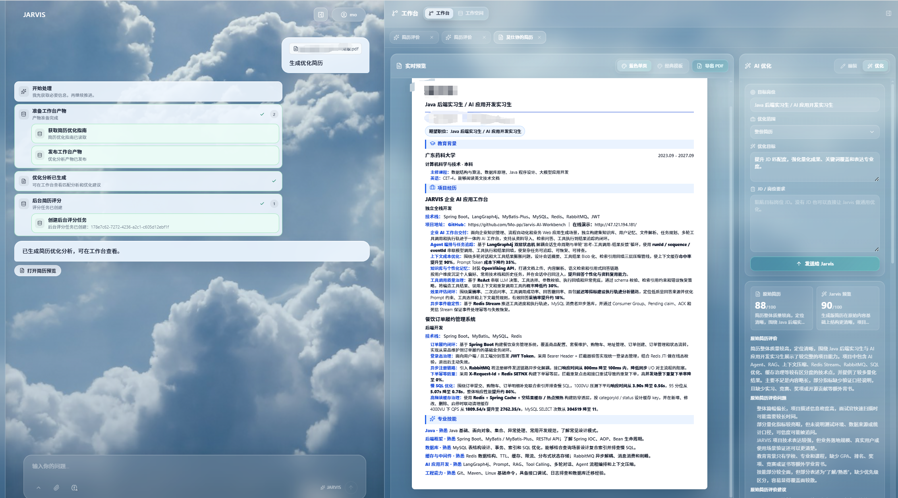

# 🧠 JARVIS 智能简历生成 Agent

JARVIS 是一个面向求职场景的 AI 简历生成与优化 Agent 工作台。它可以从旧简历、截图、PDF/Word/Markdown/TXT/HTML 文档、项目资料、GitHub/URL 资源和岗位 JD 中提取候选人的经历证据，生成结构化简历，并支持 JD 定向优化、质量评分、可视化编辑和 PDF 导出。

底层仍然是一套通用 AI Agent 工作台：LangGraph4j 状态机负责任务编排，工具系统负责资料读取、用户追问、产物发布和评分任务，OpenViking 承载资源库、Skill 和长期记忆，React 前端提供对话、Trace、资料库和简历预览编辑体验。项目当前的产品主线聚焦在“把资料变成可投递简历”。

## 🖼️ 示例截图

以下截图展示了 JARVIS 的对话工作台、执行轨迹和结果预览效果。




## 🎯 项目定位

很多简历工具只能做模板编辑，JARVIS 更关注“经历理解”和“岗位匹配”：

- 从旧简历、截图或文档中还原教育背景、项目经历、技能栈和联系方式。
- 从 GitHub、项目 README、接口文档、技术说明中提取能写进简历的业务场景、技术动作和量化结果。
- 根据目标岗位 JD 改写项目描述，补强关键词、业务价值、技术深度和匹配度。
- 缺少关键信息时由 Agent 自动追问，而不是凭空补内容。
- 输出统一的 `ResumeVO` 结构化简历，前端可以预览、编辑、切模板、压缩排版并导出 PDF。
- 后台可以对原始简历、生成简历和 JD 匹配度做异步评分，帮助定位简历问题。

项目不是把通用聊天机器人简单套上简历模板，而是把通用 Agent 能力收敛到简历生成链路：资料收集、证据抽取、结构化生成、岗位优化、评分反馈和最终导出。

## 🔁 核心流程

```text
上传旧简历 / 简历截图 / 项目资料 / JD
  -> Agent 解析资料和候选人目标
  -> 必要时追问缺失信息
  -> 提取经历证据和项目亮点
  -> 生成结构化 ResumeVO
  -> 发布到简历工作台预览
  -> 执行简历质量和 JD 匹配评分
  -> 用户编辑、切模板、导出 PDF
```

## ✨ 功能概览

### 📝 简历生成

- 支持从用户粘贴文本、上传文档、图片附件和资源库引用中生成简历。
- 支持 PDF、Word、TXT、HTML 等文件解析，图片附件会作为多模态内容传给支持视觉能力的 LLM。
- 内置 `getResumeGuide` 工具，为 Agent 提供结构化简历字段、写法边界和发布规则。
- 生成结果以 `type=resume` 的 `ChatArtifact` 发布，前端自动打开简历工作台。

### 🛠️ 简历优化

- 内置 `getOptimizeGuide` 工具，指导 Agent 对已有简历做岗位导向改写。
- 优化目标包括项目表述、技能分组、结果量化、关键词覆盖、简历可读性和版面密度。
- 输出 `type=optimize_result` 产物，可同时包含优化说明、匹配分析、优化后简历和评分任务信息。
- 支持在同一工作台里对优化前后版本做查看和继续编辑。

### 📊 JD 匹配与评分

- `evaluateResume` 工具会创建异步简历评分任务，结果由 `/api/resume/evaluation` 相关接口查询。
- 支持无 JD 的简历质量评价，也支持带 JD 的岗位匹配评价。
- 评分结果覆盖信息完整性、经历表达、项目深度、技能组织、JD 关键词匹配等维度。
- 对上传文件来源的原始简历，评分任务会优先使用 `sourceFileId`，避免把大段原文塞回工具参数。

### 🧩 简历工作台

- React 前端提供结构化简历预览、字段编辑、模板切换、排版密度控制和溢出提示。
- 简历样式由 `resumeStyle` 和模板组件控制，适合持续扩展不同版式。
- PDF 导出由前端提交渲染后的 HTML，后端使用 Playwright 生成 PDF。
- 导出确认不交给 LLM 追问，用户在工作台点击导出按钮完成下载。

### 📚 资料库与证据引用

- 支持上传文件、创建 Markdown 文本资源、导入 HTTP(S)/Git/SSH URL。
- 资源统一进入 OpenViking 的 `viking://resources/` 命名空间。
- 对话输入可引用 `viking://...` 资源 URI，Agent 会把这些路径作为明确上下文。
- 资源库、工作空间、Skill 和长期记忆统一由 OpenViking 接入。

### 🧭 Agent 执行轨迹

- SSE 流式事件覆盖文本增量、工具调用、任务更新、用户追问、子 Agent 派发、产物发布和错误状态。
- TraceService 为 LLM 轮次、工具批次、工具调用、产物生成和子 Agent 过程建立可回放步骤。
- TimelineAction 持久化到 MySQL，历史会话中可以回放关键执行过程。
- Langfuse Trace 可用于观察简历生成链路、上下文压缩、缓存命中和评测结果。

## 🏗️ Agent 架构

JARVIS 后端采用双层状态机。

外层状态机负责会话生命周期：

```text
START -> session_init -> run_inner_loop -> usage_stat -> END
```

内层状态机负责单次请求的 Agent 循环：

```text
call_llm -> route -> execute_tool / error_recovery / END
```

一次简历生成通常会经历：

```text
用户输入
  -> 注入上传文件和图片附件
  -> 构建系统 Prompt 与动态上下文
  -> LLM 判断任务计划
  -> 调用简历指南、资源读取、用户追问、子 Agent 或评分工具
  -> publishArtifact 发布 resume / optimize_result
  -> 前端工作台渲染结构化产物
```

关键工程能力：

- **TaskPlan**：Agent 可以创建、更新和回传任务列表，前端展示执行进度。
- **AskUserQuestion 阻塞恢复**：缺姓名、时间、岗位、项目细节等信息时，Agent 可以挂起等待用户补充。
- **子 Agent 派发**：可把资料探索、业务提炼等子任务交给隔离子状态机执行。
- **上下文压缩**：L1 Tool Result Budget、L3 Microcompact、L5 Autocompact 降低长会话上下文膨胀。
- **工具延迟加载**：核心工具常驻，低频工具通过 `toolSearch` 按需发现，减少每轮工具 schema 成本。
- **Prefix Cache 观测**：CacheTracker 记录 cached tokens、命中率和连续未命中情况。

## 🗄️ 主要数据表

MySQL 表结构由 Flyway 迁移脚本维护，迁移文件位于 `src/main/resources/db/migration/`。

- `db_account`：用户账户、BCrypt 密码、邮箱、头像、注册时间和 OpenViking 管理密钥。
- `ai_session`：AI 会话元信息、所属用户、标题、状态、置顶信息、Token 统计和活跃时间。
- `ai_message`：用户消息、AI 消息、工具调用 JSON、工具执行结果、附件元数据和压缩标记。
- `ai_timeline_action`：前端可回放的执行轨迹，保存工具调用、任务状态和子 Agent 过程。
- `resume_evaluation_job`：异步简历评分任务、原始简历来源、生成简历、JD 和评分结果。

关系概览：

```text
db_account.username
  -> ai_session.owner_username
       -> ai_message.session_id
       -> ai_timeline_action.session_id
       -> resume_evaluation_job.session_id
```

知识库、Skill、长期记忆和工作空间资源由 OpenViking 侧服务管理，JARVIS 通过接口和工具接入。

## 🛠️ 技术栈

### ☕ 后端

- **语言**：Java 21
- **框架**：Spring Boot 4.0.5
- **Agent 状态机**：LangGraph4j 1.8.11
- **LLM 抽象**：LangChain4j 1.13.0
- **数据库**：MySQL 8.0+、MyBatis-Plus
- **缓存和短期状态**：Redis
- **消息和异步能力**：RabbitMQ、Spring Async
- **数据库迁移**：Flyway
- **安全**：Spring Security、JWT、接口限流、邮箱验证码
- **文件解析**：Apache PDFBox、Apache POI、Jsoup
- **PDF 渲染**：Playwright

### ⚛️ 前端

- **框架**：React 19 + Vite
- **语言**：TypeScript
- **HTTP 客户端**：Axios
- **样式**：Tailwind CSS + 自定义简历排版样式
- **图标**：lucide-react
- **思维导图**：markmap-lib、markmap-view
- **可视化**：D3

### 🤖 LLM 与集成

- OpenAI 兼容 Chat Completions / Responses
- 智谱 GLM
- 通义千问 DashScope
- 百度千帆 Coding Plan
- MCP 工具接入
- OpenViking 资源、Skill、工作空间和长期记忆
- Langfuse Trace 与简历生成评测脚本

## 📦 项目结构

```text
JARVIS/
├── src/
│   ├── main/
│   │   ├── java/com/msz/resume/ai/
│   │   │   ├── agent/                # 子 Agent 类型与注册
│   │   │   ├── auth/                 # 用户认证、JWT、限流、邮件验证码
│   │   │   ├── chat/                 # 会话、状态机、LLM、压缩、Trace
│   │   │   ├── file/                 # 文件上传、存储和解析
│   │   │   ├── hook/                 # 工具 Hook 配置与执行
│   │   │   ├── integrations/         # MCP、OpenViking 集成
│   │   │   ├── memory/               # 用户记忆工具
│   │   │   ├── resume/               # 简历生成、优化、评分和导出
│   │   │   ├── shared/               # 通用模型和工具类
│   │   │   └── tool/                 # 工具注册中心与基础工具
│   │   └── resources/
│   │       ├── db/migration/         # Flyway 数据库迁移
│   │       ├── hooks/                # 工具 Hook 配置
│   │       ├── prompts/              # YAML 系统提示词
│   │       └── application.yml       # 后端配置
│   └── test/
├── jarvis-frontend/
│   ├── src/
│   │   ├── components/               # 对话、简历工作台、资源库、设置等组件
│   │   ├── hooks/                    # 流式对话 Hook
│   │   ├── services/                 # API 客户端
│   │   └── types/                    # 前端类型定义
├── scripts/                          # 简历评测和辅助脚本
├── docs/                             # 设计文档
├── docker/                           # 部署镜像配置
└── pom.xml
```

公开发布版本默认不包含本地 `.env`、`application-dev.yml`、`application-local.yml`、构建产物和个人开发环境目录。

## 🚀 快速开始

### ✅ 环境要求

- JDK 21
- Maven 3.9+
- Node.js 20+
- MySQL 8.0+
- Redis
- 至少一个可用的 LLM API Key
- OpenViking 服务与 API Key

项目内置 `.mvn/settings.xml`，默认将 Maven Central 请求切到阿里云 Maven 公共镜像，以提升国内环境下的依赖下载速度。

### 1. 🗃️ 准备数据库

```sql
CREATE DATABASE ai_resume CHARACTER SET utf8mb4 COLLATE utf8mb4_unicode_ci;
```

应用启动后 Flyway 会自动执行 `src/main/resources/db/migration/` 下的迁移脚本。

### 2. 🔐 配置后端环境变量

最小启动配置示例：

```bash
export SPRING_DATASOURCE_URL="jdbc:mysql://localhost:3306/ai_resume?useUnicode=true&characterEncoding=utf-8&serverTimezone=Asia/Shanghai"
export SPRING_DATASOURCE_USERNAME="root"
export SPRING_DATASOURCE_PASSWORD="your_mysql_password"
export SPRING_DATA_REDIS_HOST="localhost"
export SPRING_DATA_REDIS_PORT="6379"
export JARVIS_SECURITY_KEY="replace-with-a-long-random-secret"
export JARVIS_LLM_PROVIDER="gpt"
export OPENAI_API_KEY="your_openai_or_compatible_api_key"
export OPENAI_BASE_URL="https://api.csprokit.cn/v1"
export OPENAI_MODEL="gpt-5.5"
export OPENVIKING_BASE_URL="your_openviking_base_url"
export OPENVIKING_API_KEY="your_openviking_api_key"
```

Windows PowerShell 示例：

```powershell
$env:SPRING_DATASOURCE_PASSWORD="your_mysql_password"
$env:JARVIS_SECURITY_KEY="replace-with-a-long-random-secret"
$env:JARVIS_LLM_PROVIDER="gpt"
$env:OPENAI_API_KEY="your_openai_or_compatible_api_key"
$env:OPENAI_BASE_URL="https://api.csprokit.cn/v1"
$env:OPENAI_MODEL="gpt-5.5"
$env:OPENVIKING_BASE_URL="your_openviking_base_url"
$env:OPENVIKING_API_KEY="your_openviking_api_key"
```

可选配置：

- `BIGMODEL_API_KEY`：智谱 GLM
- `DASHSCOPE_API_KEY`：通义千问
- `QIANFAN_OPENAI_API_KEY`：千帆 Coding Plan
- `MAIL_USERNAME`、`MAIL_PASSWORD`：邮箱验证码
- `OPENVIKING_SESSION_ENABLED=true`：启用 OpenViking Session 同步
- `OPENVIKING_RECALL_ENABLED=true`：启用 OpenViking 自动召回
- `VITE_RESUME_EVALUATION_API_URL=/api/resume/evaluation`：前端简历评分接口地址

### 3. ▶️ 启动后端

```bash
mvn spring-boot:run
```

默认后端地址：

```text
http://localhost:8084
```

### 4. 💻 启动前端

```bash
cd jarvis-frontend
npm install
cp .env.example .env
npm run dev
```

前端开发服务器默认地址：

```text
http://localhost:5175
```

开发环境下，前端通过 Vite proxy 将 `/api` 请求转发到 `http://localhost:8084`。

## 🧪 验证与评测

常用检查：

```bash
mvn test
cd jarvis-frontend
npm run build
npm run verify:resume-preview
```

简历截图生成评测脚本位于 `scripts/run_langfuse_resume_image_eval.py`，用于批量调用 JARVIS 多模态简历生成链路，并把结构化简历产物写入 Langfuse 评测结果。

## 🗺️ Roadmap

- 简历版本管理：保存不同岗位、不同模板、不同优化策略的版本。
- 模板体系：沉淀后端/AI/产品/运营等不同岗位的简历模板。
- JD 批量匹配：一次上传多条 JD，生成匹配分、关键词缺口和投递优先级。
- 经历证据链：简历每条项目亮点可以追溯到 GitHub、文档或用户补充信息。
- 多模态解析稳定化：强化简历截图、扫描件和复杂 PDF 的结构提取能力。
- 评分闭环：用 Langfuse 数据集持续评估信息保留率、项目标题准确率、技能分组质量和 JD 匹配提升。

## 📄 声明

本项目为学习与实验性项目，接口、配置项、数据结构和提示词仍可能调整。部分工具设计、实现思路或代码片段可能参考、借鉴并改装自公开开源项目，再结合 JARVIS 的 Agent、工具系统和简历工作台架构做了适配。项目维护者尊重原作者和开源协议；如果存在署名遗漏、协议理解偏差或疑似侵权问题，请及时联系，我会尽快核实并进行补充说明、修改或删除。
